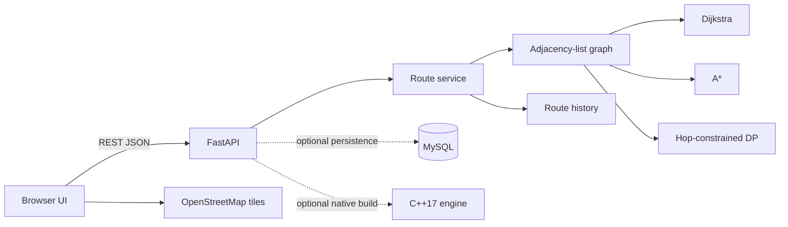

# Smart Traffic Route Optimizer

A B.Tech major-project demonstration of traffic-aware route planning. A road network is an adjacency-list graph; Dijkstra and A* search real edges whose costs change with congestion and road condition. The FastAPI service exposes route comparisons, traffic simulation, statistics, and history. The Leaflet UI displays the returned network and paths over OpenStreetMap.

## Problem and proposed system

Shortest-distance routing can be slow when the short roads are congested or in poor condition. This project minimizes a configurable generalized road cost instead:

`edge_cost = w_distance × distance_km + w_time × travel_minutes + w_traffic × congestion_penalty_minutes + w_condition × condition_penalty_minutes`

Travel minutes are free-flow minutes multiplied by `1 + 1.6 × congestion`; congestion penalty is free-flow minutes times congestion; condition penalty is free-flow minutes times a road-condition severity. Weights are non-negative and normalized to sum to one. Traffic is simulated and is not a live traffic feed.

The proposed system returns the shortest-distance, fastest-time, and lowest-cost paths and compares Dijkstra with A*. The A* heuristic is straight-line distance times the minimum generalized cost per geographic kilometre of any edge, a lower bound on remaining path cost. An optional maximum-hop constraint is solved by layered dynamic programming.

## Architecture and structure

```text
frontend/                  HTML, CSS, Leaflet map and dashboard scripts
backend/
  main.py                  FastAPI application and endpoints
  services/                Graph model, cost model, searches and demo graph
  schemas/                 Request validation
  database/                Optional MySQL connection and schema
  tests/                   Pytest algorithm and API tests
cpp/                       Modular C++17 graph/search engine
docs/                      Architecture, diagrams, algorithms and API notes
```



## Run locally

Requirements: Python 3.10+, pip, and a modern browser. A C++17 compiler (g++ or clang++) is optional for building/running the standalone engine. No external routing API is used.

```powershell
cd backend
python -m venv .venv
.\.venv\Scripts\Activate.ps1
pip install -r requirements.txt
uvicorn main:app --reload
```

Open `http://127.0.0.1:8000`. API documentation is at `/docs`. The app includes demo intersections A–H and seeded simulated traffic. OpenStreetMap tiles require internet access; routing and API logic do not.

### Deploy to Render from GitHub

The root `render.yaml` describes a Render web service that installs the backend dependencies, compiles the C++17 route engine, and starts FastAPI serving both the UI and API. Push the repository to GitHub, create a Render account, then in Render choose **New → Blueprint** and select the repository. Render will build and deploy the service; open its generated `onrender.com` URL. No MySQL is required for the demo; the process uses simulated traffic and in-memory history unless the MySQL environment variables are configured. OpenStreetMap tiles require internet access.

GitHub Pages alone cannot run the FastAPI API or C++ engine; use the Render blueprint for the complete application.

Run tests from `backend`:

```powershell
pytest -q
```

### Optional C++ build

From the project root:

```powershell
g++ -std=c++17 -O2 -Wall -Wextra cpp/main.cpp cpp/Graph.cpp cpp/TrafficModel.cpp cpp/Dijkstra.cpp cpp/AStar.cpp cpp/RouteOptimizer.cpp -o cpp/route_engine
```

The standalone engine accepts a line-oriented input format documented in `cpp/README.md`. For API-side native execution, set `ROUTE_ENGINE_PATH` to the compiled executable before launching FastAPI; each optimization then invokes the C++ Dijkstra and A* engine and uses its measured comparison values. If unset, the API executes the same graph searches directly in Python. No opaque or external routing service is substituted for the implemented searches.

## Algorithms and complexity

For `V` intersections and `E` roads, adjacency-list storage is `O(V + E)`. Hash maps provide expected `O(1)` ID lookup. Dijkstra with a binary heap is `O((V + E) log V)` time and `O(V + E)` space. A* has the same worst-case bound and often explores fewer nodes with its admissible heuristic. Path reconstruction is `O(path length)`. Hop-limited DP relaxes edges for each permitted hop: `O(H × E)` time and `O(H × V)` space when predecessors are retained. Each displayed objective is independently optimized; alternatives can coincide when the graph has no distinct feasible route.

## Important limitations

The included network and traffic values are a small reproducible simulation, not production road data. OSM is used for map tiles only; its road geometry is not silently treated as the optimizer's graph. History is in memory by default. Apply `backend/database/schema.sql`, then configure `MYSQL_HOST`, `MYSQL_PORT` (optional), `MYSQL_USER`, `MYSQL_PASSWORD`, and `MYSQL_DATABASE` to enable persistent traffic observations and route history. Database credentials are read from environment variables and no credentials are checked in.

See [docs/PROJECT.md](docs/PROJECT.md), [docs/API.md](docs/API.md), and [cpp/README.md](cpp/README.md) for the mathematical model, diagrams, setup, and C++ protocol.
