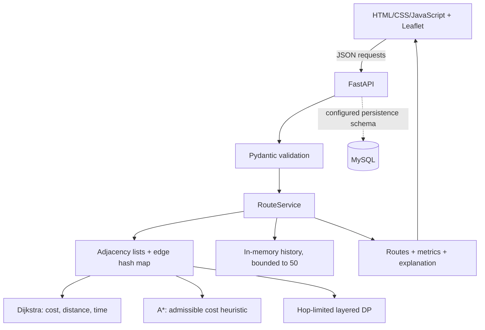
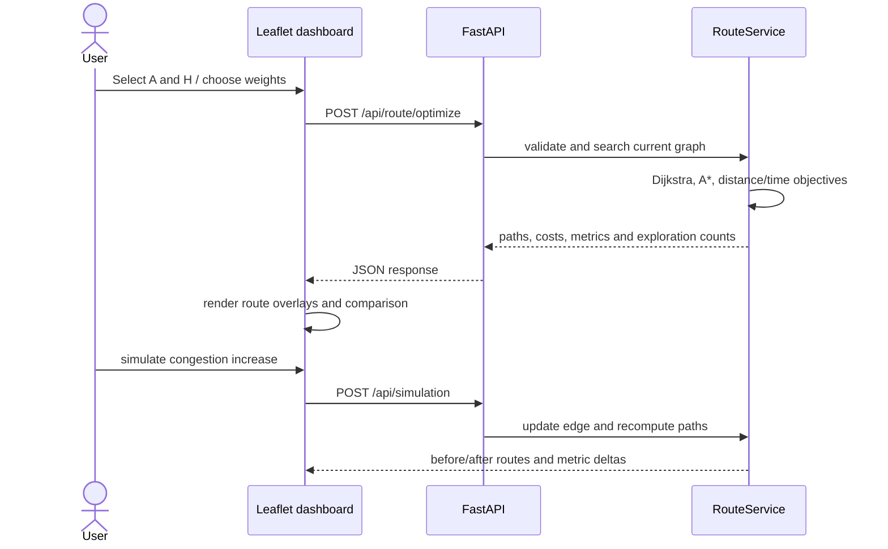
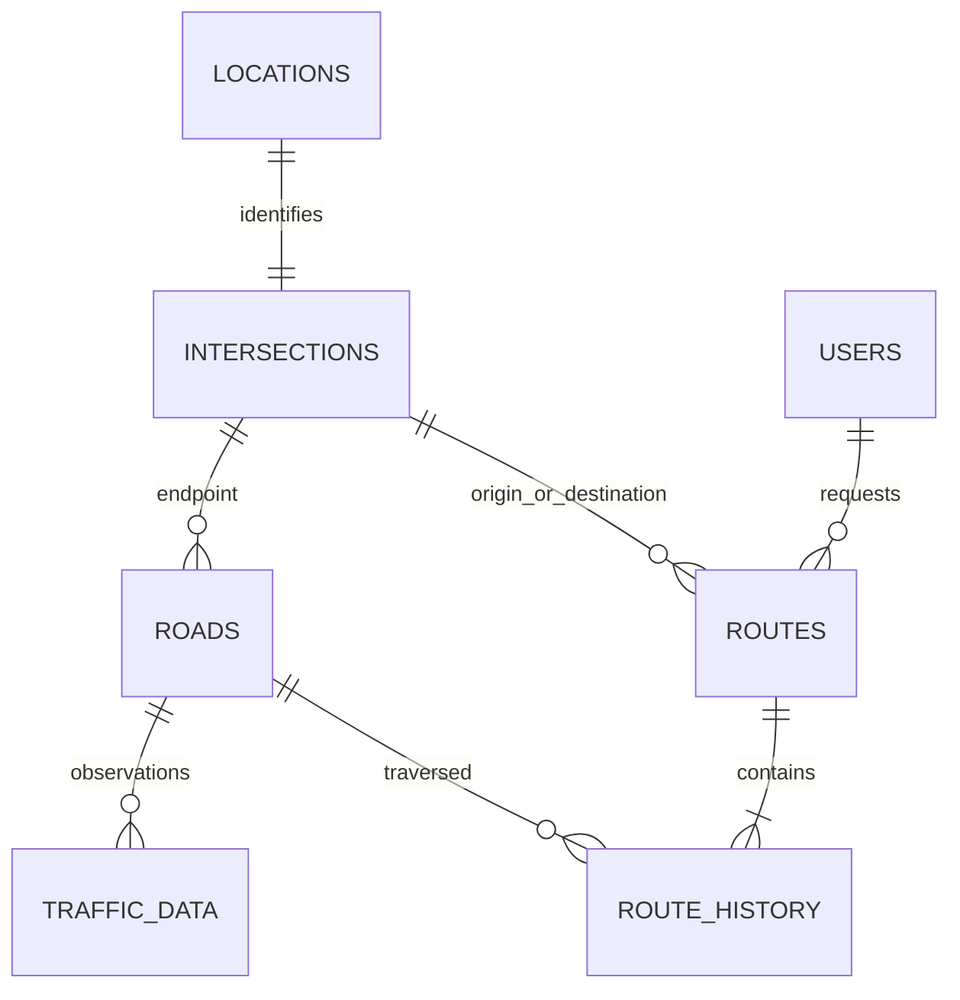
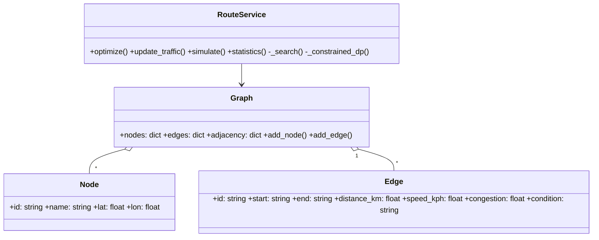

# Project design and academic notes

## Problem statement

Given intersections and road segments with distance, speed limit, changing congestion, and surface condition, find a path that minimizes generalized travel cost rather than distance alone. The system must compare objectives, explain path selection, and respond to simulated incidents.

## Existing system limitations and proposal

Distance-only shortest paths ignore delay and road quality; static weights do not reflect traffic changes; a map alone does not explain algorithmic choices. This project models explicit road costs and reports distance, estimated time, traffic, total generalized cost, explored nodes, and alternative objective paths. Traffic simulation changes edge costs and triggers a fresh search.

## Mathematical model

For edge `e`, free-flow time `t0(e) = 60 d(e) / speed(e)`. For congestion fraction `c ∈ [0,1]`:

* estimated travel time `t(e) = t0(e)(1 + 1.6c)`;
* congestion penalty `p_t(e) = t0(e)c`;
* condition penalty `p_r(e) = t0(e)s(e)`, where `s` is condition severity in `[0,1]`;
* generalized cost `C(e) = wd d(e) + wt t(e) + wc p_t(e) + wr p_r(e)`.

All weights are non-negative and sum to one. A path cost is the sum of edge costs. The factors are an explicit simulation model and may be calibrated with observed local data.

## Graph representation

Intersections are vertices with IDs and coordinates. Roads are undirected weighted edges; adjacency lists store road IDs at both endpoints, and dictionaries index nodes and edges. The map displays these same demo graph edges; OSM provides basemap tiles only.

## Algorithms

* **Dijkstra:** Binary min-heap over accumulated non-negative edge cost. It yields a globally minimum path for the selected additive objective.
* **A*:** Same edge cost with a geographic lower-bound heuristic. The heuristic uses straight-line distance times the minimum edge cost per geographic kilometre of any edge, never exceeding a feasible remaining cost even if reported road lengths differ from coordinate geometry. It is admissible and consistent for the demo graph's non-negative metrics.
* **Alternative objectives:** Dijkstra is run against distance and estimated-time edge metrics to obtain shortest-distance and fastest-time routes. Paths may coincide where the graph has no better distinct option.
* **Dynamic programming:** When a maximum number `H` of road segments is specified, a layered relaxation retains the best known cost to each vertex across at most each additional hop. This is useful for stop/turn limits; it runs in `O(H E)` time and stores predecessor paths in `O(H V)` space in this implementation.
* **Reconstruction:** Each improved search state stores predecessor node and road. Walking predecessors backward and reversing produces the displayed route.

For `V` vertices and `E` edges, adjacency storage is `O(V+E)`, indexed lookup is expected `O(1)`, Dijkstra and A* worst case are `O((V+E) log V)` time and `O(V+E)` space, and path reconstruction is `O(L)`. A* may expand fewer vertices but does not improve the worst-case bound.

## System architecture and data flow

## ER model

## UML / class relationships

## Demonstration and expected behavior

The UI loads the sample A–H network, executes actual graph searches on page load, and renders the optimized path in teal, alternatives dashed, and roads colored by congestion. A route search displays the distinct shortest-distance, fastest-time, and lowest-generalized-cost results (where they differ), A*/Dijkstra explored counts and timing, and total metrics. A traffic simulation scales a selected road's congestion, clamps it to 100%, computes before/after routes, and redraws the updated network. It persists simulated traffic for the running process until restart.

The graph purposely contains short high-congestion and longer lower-congestion paths; the route selection is computed from current edge values rather than a preselected answer. API timings are measurements of the actual search call and are machine-dependent.

## API reference

Detailed schemas and examples are in [API.md](API.md); interactive OpenAPI is served from `/docs`.

## Tests

`backend/tests/test_routing.py` covers normal/objective pathfinding, congestion-induced rerouting, unreachable and invalid/equal endpoints, severe congestion, alternatives and Dijkstra/A* parity, hop-limited DP, request validation, and simulation responses.

## Limitations and future enhancements

Demo roads and traffic are synthetic; estimated speeds are not live observations. The API stores history in process memory unless MySQL is configured. Apply the supplied SQL schema and set the `MYSQL_*` environment variables to persist traffic updates and route history. Extend with authenticated users, migrations, live sensor/API ingestion, time-dependent edge costs, real road geometry, incident feeds, and deployment monitoring. OSM tiles require internet access.
